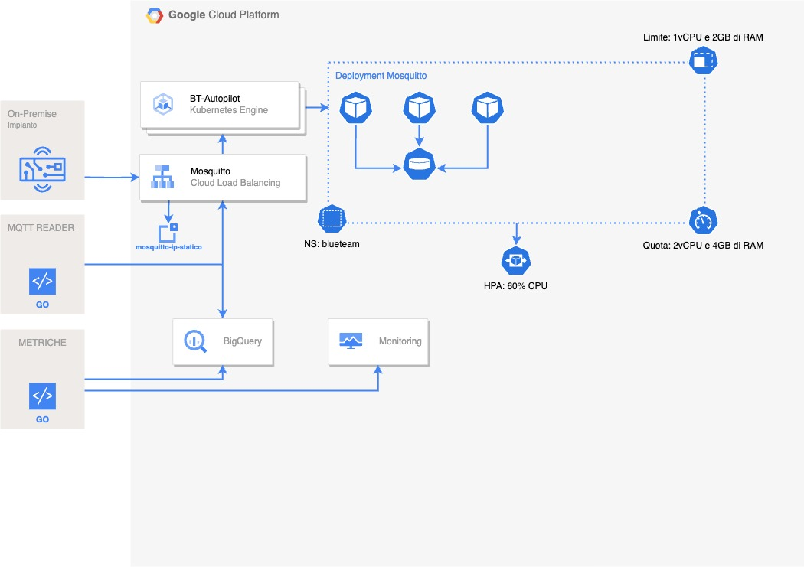

# IoT System Documentation

This documentation provides a technical overview of the IoT system built using Mosquitto, Golang, and Google Kubernetes Engine (GKE). It covers the steps involved in setting up the system, including messaging infrastructure, device code, central control system, and deployment on GKE.

# System Diagram

## Table of Contents

- [Introduction](#introduction)
- [Prerequisites](#prerequisites)
- [Setting up Mosquitto on GKE](#setting-up-mosquitto-on-gke)
- [Defining MQTT Topics](#defining-mqtt-topics)
- [Writing Device Code](#writing-device-code)
- [Connecting Devices to Mosquitto](#connecting-devices-to-mosquitto)
- [Central Control System](#central-control-system)
- [Deploying on GKE using Terraform](#deploying-on-gke-using-terraform)

## Introduction

The IoT system allows for the integration of 10 devices using Mosquitto, Golang, and GKE. It enables communication between devices, a central control system, and users interacting with the system through natural language. The system leverages MQTT as the messaging protocol and GKE for deployment and management.

## Prerequisites

Before setting up the IoT system, ensure you have the following prerequisites in place:

- Access to a Google Cloud Platform (GCP) account
- GCP project created with appropriate permissions
- GCP command-line tool (`gcloud`) installed
- Terraform installed locally

## Setting up Mosquitto on GKE

To set up Mosquitto on GKE, follow these steps:

1.  Create a Kubernetes cluster on GKE using the Google Cloud Console or the `gcloud` command-line tool.
2.  Install and configure the Mosquitto Helm chart to deploy Mosquitto on the GKE cluster. Execute the following commands:

    helm repo add stable https://charts.helm.sh/stable
    helm install mosquitto stable/mosquitto

3.  Verify the successful deployment of Mosquitto on GKE.

## Defining MQTT Topics

MQTT topics represent different types of data or actions within the IoT system. The following MQTT topics have been defined for this system:

- `devices/alarm/generic`
- `devices/alarm/logic`
- `devices/temperature/ambient`
- `devices/temperature/external`
- `devices/humidity/relative`
- `devices/humidity/set`
- `devices/humidity/effective_set`
- `...`

You can see the entire list here: https://lightmnd.github.io/gcp-iot-air-devices-system/

## Writing Device Code

Each device within the IoT system requires specific device code. The device code, written in Golang, connects to the Mosquitto broker and publishes or subscribes to MQTT topics based on its functionality. Implement device-specific logic such as sensor readings, actuator control, or data processing within the code.

## Connecting Devices to Mosquitto

To connect devices to Mosquitto, utilize the MQTT client library within the device code. Provide the necessary credentials (e.g., username, password) and connect to the appropriate MQTT topics for publishing or subscribing.

## Central Control System

The central control system manages the IoT devices and communicates with the devices using MQTT. It is written in Golang and incorporates an MQTT client to subscribe to relevant topics and receive data from the devices. Implement logic within the central control system to process incoming data, perform analytics, and control the devices based on desired actions.

## Deploying on GKE using Terraform

Use Terraform to provision the necessary resources on GKE and deploy the IoT system. The provided Terraform template sets up a GKE cluster for deployment. Adjust the template to include the required resources such as Mosquitto, device code, and the central control system. Ensure you have the necessary credentials for Google Cloud authentication. Run Terraform commands `init`, `plan`, and `apply` to deploy the system on GKE.

For more details and customization, refer to the code snippets and explanations provided in the respective sections.

---

This technical documentation provides an overview of the IoT system, including the steps involved and the necessary code snippets. Use this document as a guide to set up and understand the different components of the system. Adjust the code and configurations according to your specific requirements and use cases.

---
## Remote Control

https://github.com/lightmnd/gcp-iot-air-devices-system/assets/19961172/1521a473-4fbc-4ea3-b269-9288c8bd19e7

## Random Data

https://github.com/lightmnd/gcp-iot-air-devices-system/assets/19961172/e67f1362-2bf5-49e0-aa6b-645800ac3037

## Theoretical Costs and Cost Summary

